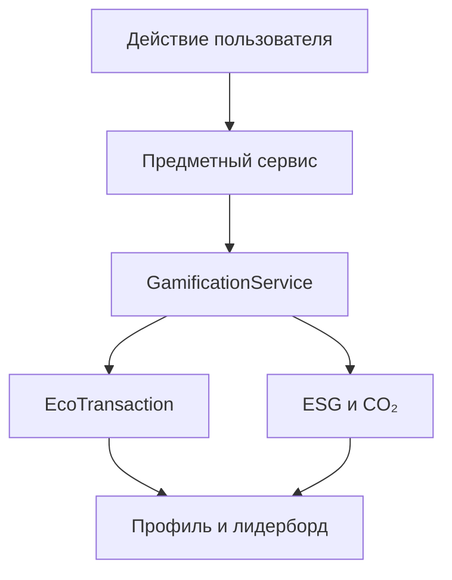
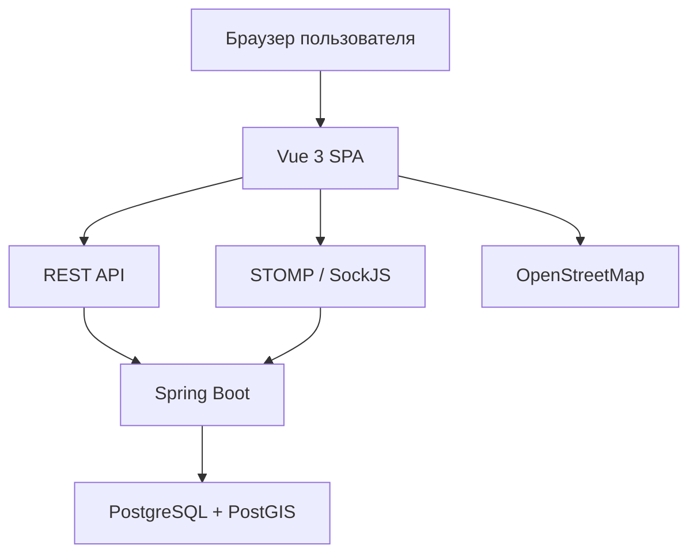
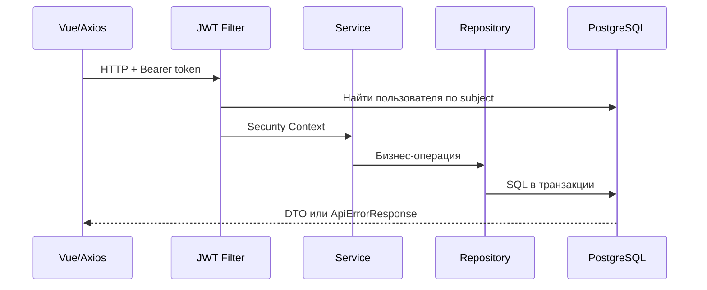
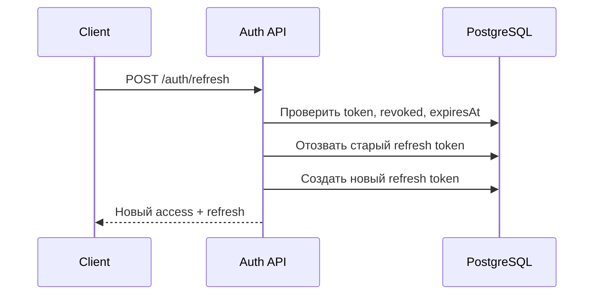
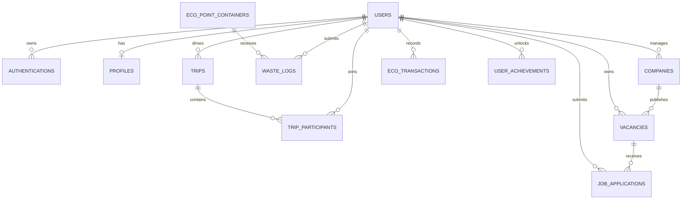
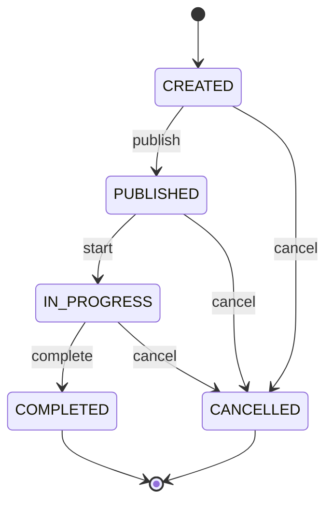
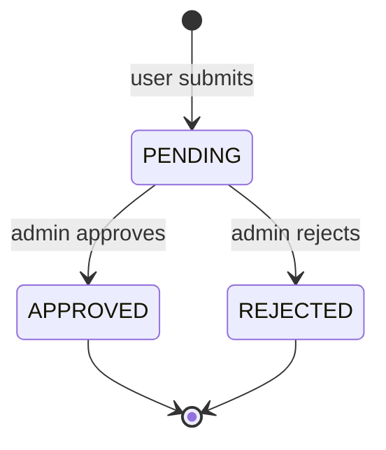
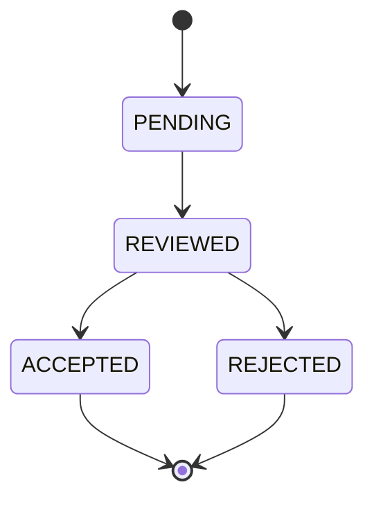

# KBTU Green Ecosystem — техническая документация

| Поле | Значение |
| --- | --- |
| Проект | KBTU Green Ecosystem |
| Версия системы | MVP 1.0 |
| Версия документа | 1.0 |
| Дата | 25 августа 2026 года |
| Тип системы | SPA + REST API + WebSocket |
| Репозиторий | <https://github.com/NuranBerdaliyev/kbtu-green-ecosystem> |
| Статус | Демонстрационная версия учебного проекта |

Документ описывает фактически реализованный MVP: архитектуру, модель данных,
безопасность, бизнес-правила, HTTP API, WebSocket-события и порядок локального
запуска. Пользовательские инструкции вынесены в отдельный паспорт проекта.
## Оглавление

1. [Назначение и границы системы](#1-назначение-и-границы-системы)
2. [Технологический стек](#2-технологический-стек)
3. [Архитектура системы](#3-архитектура-системы)
4. [Структура репозитория](#4-структура-репозитория)
5. [Архитектура backend](#5-архитектура-backend)
6. [Архитектура frontend](#6-архитектура-frontend)
7. [Аутентификация, JWT и роли](#7-аутентификация-jwt-и-роли)
8. [Модель данных](#8-модель-данных)
9. [Миграции Flyway](#9-миграции-flyway)
10. [Модули и бизнес-логика](#10-модули-и-бизнес-логика)
11. [HTTP API](#11-http-api)
12. [WebSocket](#12-websocket)
13. [Конфигурация](#13-конфигурация)
14. [Локальный запуск](#14-локальный-запуск)
15. [Демонстрационные данные](#15-демонстрационные-данные)
16. [Проверка работоспособности](#16-проверка-работоспособности)
17. [Ограничения MVP](#17-ограничения-mvp)

---

## 1. Назначение и границы системы

KBTU Green Ecosystem — единая платформа для экологической, социальной и
карьерной активности внутри университета. Система объединяет четыре предметных
модуля:

- **Carpool** — совместные поездки и расчёты между водителем и пассажирами;
- **EcoWaste** — контейнеры, заявки на сдачу отходов и контроль заполненности;
- **Career Hub** — компании, вакансии, отклики и отбор кандидатов;
- **Gamification** — EcoCoins, ESG-рейтинг, предотвращённый CO₂, достижения и
  лидерборд.

Административный модуль управляет пользователями, контейнерами, партнёрством
компаний, публикацией вакансий и проверкой заявок на сдачу отходов.

### 1.1 Основной системный поток



### 1.2 Границы MVP

MVP предназначен для локального запуска и демонстрации полного пользовательского
сценария. В текущую версию не входят интеграция с физическими весами контейнеров,
GPS-подтверждение поездок, серверный отзыв refresh-токена при выходе и
production-развёртывание.

---

## 2. Технологический стек

| Область | Технологии |
| --- | --- |
| Backend | Java 21, Spring Boot 3.3.5, Maven |
| Web API | Spring Web, Bean Validation |
| Безопасность | Spring Security, JWT (`jjwt` 0.12.6), BCrypt |
| Доступ к данным | Spring Data JPA, Hibernate ORM, Hibernate Spatial |
| База данных | PostgreSQL 16, PostGIS 3.4 |
| Миграции | Flyway |
| Real-time | Spring WebSocket, STOMP, SockJS |
| Frontend | Vue 3, Vite, Vue Router, Pinia |
| HTTP-клиент | Axios |
| Карты | Leaflet, OpenStreetMap |
| Frontend WebSocket | `@stomp/stompjs`, `sockjs-client` |
| Инфраструктура разработки | Docker Compose |
| Backend-тестирование | JUnit 5, Mockito, Spring Boot Test, Testcontainers |

---

## 3. Архитектура системы

Приложение использует модульный монолит. Backend развёртывается как один Spring
Boot-процесс, frontend — как отдельное SPA. Все модули используют общую базу
данных и единый сервис геймификации.



### 3.1 Компоненты

| Компонент | Ответственность |
| --- | --- |
| Vue SPA | Интерфейс, маршрутизация, формы, хранение текущей сессии, вызов API |
| REST API | Синхронные операции над сущностями и запуск бизнес-сценариев |
| WebSocket | Передача изменений контейнеров и административных предупреждений |
| Service layer | Транзакции, права владения, переходы состояний и расчёты |
| Repository layer | JPA-доступ, запросы, сортировка и блокировки строк |
| PostgreSQL | Основные данные, ограничения целостности и журнал транзакций |
| PostGIS | Координаты поездок и контейнеров в формате `Point(4326)` |
| Flyway | Последовательное создание и обновление схемы |

### 3.2 Принципы реализации

- контроллеры не содержат бизнес-логику;
- идентификатор текущего пользователя берётся из Security Context, а не из
  клиентского тела запроса;
- финансовые и рейтинговые изменения выполняются через `GamificationService`;
- критические изменения выполняются внутри транзакций;
- конкурентные операции используют пессимистическую блокировку;
- ограничения предметной области дублируются на уровне Java и PostgreSQL;
- WebSocket-сообщения о контейнерах отправляются после успешного commit.

---

## 4. Структура репозитория

```text
kbtu-green-ecosystem/
├── backend/
│   ├── docker-compose.yml
│   └── green/
│       ├── pom.xml
│       └── src/
│           ├── main/
│           │   ├── java/com/example/green/
│           │   │   ├── api/
│           │   │   │   ├── controller/
│           │   │   │   ├── dto/
│           │   │   │   ├── error/
│           │   │   │   └── mapper/
│           │   │   ├── config/
│           │   │   ├── domain/
│           │   │   │   ├── entity/
│           │   │   │   ├── enums/
│           │   │   │   ├── model/
│           │   │   │   └── repository/
│           │   │   ├── security/
│           │   │   └── service/
│           │   └── resources/
│           │       ├── db/migration/
│           │       ├── application.yaml
│           │       ├── application-dev.yaml
│           │       └── application-prod.yaml
│           └── test/java/com/example/green/
└── frontend/
    ├── package.json
    ├── vite.config.js
    └── src/
        ├── api/
        ├── assets/
        ├── components/
        ├── composables/
        ├── layouts/
        ├── router/
        ├── stores/
        ├── utils/
        └── views/
```

---

## 5. Архитектура backend

### 5.1 Слои

| Слой | Пакет | Назначение |
| --- | --- | --- |
| Controller | `api.controller` | Маршруты, HTTP-статусы, валидация входных данных |
| Request/Response DTO | `api.dto` | Контракт между frontend и backend |
| Mapper | `api.mapper` | Преобразование DTO ↔ Entity и геометрии ↔ WKT |
| Error handling | `api.error` | Единый формат ошибок и сопоставление исключений с HTTP-статусами |
| Service | `service` | Бизнес-правила, транзакции, авторизация по владельцу |
| Entity | `domain.entity` | JPA-модель предметной области |
| Repository | `domain.repository` | CRUD, выборки, блокировки и агрегаты |
| Security | `security` | JWT-фильтр и STOMP-аутентификация |
| Configuration | `config` | Security, WebSocket и типизированные настройки |

### 5.2 Обработка REST-запроса



### 5.3 Транзакции и конкурентный доступ

Пессимистические блокировки применяются в операциях, где параллельные запросы
могут нарушить баланс или вместимость:

- присоединение, выход, запуск, завершение и отмена поездки;
- блокировка пользователя при списании или начислении EcoCoins;
- подтверждение заявки на отходы;
- изменение текущего веса контейнера;
- проверка суточного лимита сдачи отходов.

Записи `EcoTransaction` используются как финансовый и экологический журнал.
Для наград действует частичный уникальный индекс по пользователю, источнику и
ссылке на исходное действие, что защищает повторное начисление.

### 5.4 Единый формат ошибок

Backend возвращает ошибки в формате:

```json
{
  "timestamp": "2026-08-25T15:30:00",
  "status": 409,
  "error": "Conflict",
  "message": "Student already applied to this vacancy",
  "path": "/api/career/vacancies/5/applications",
  "validationErrors": {}
}
```

Основные статусы:

| Статус | Ситуация |
| --- | --- |
| `400 Bad Request` | Ошибка формата JSON, enum, path/query или Bean Validation |
| `401 Unauthorized` | Неверные данные входа или refresh-токен |
| `403 Forbidden` | Недостаточная роль или отсутствие права владения |
| `404 Not Found` | Сущность не найдена |
| `409 Conflict` | Недопустимое состояние, дубликат или нарушение ограничения БД |
| `500 Internal Server Error` | Необработанная серверная ошибка |

---

## 6. Архитектура frontend

Frontend построен как SPA на Vue 3.

| Каталог | Ответственность |
| --- | --- |
| `src/api` | Axios-клиенты по предметным модулям |
| `src/stores` | Pinia-состояние авторизации и геймификации |
| `src/router` | Маршруты, защита страниц и проверка ролей |
| `src/views` | Страницы Carpool, EcoWaste, Career, Profile, HR и Admin |
| `src/components` | Общие кнопки, поля, карточки, статусы, карта и layout |
| `src/composables` | Повторно используемые async- и WebSocket-сценарии |
| `src/utils` | Константы, роли, форматирование, геометрия, токены |

### 6.1 HTTP-клиенты

Из-за исторически разных backend-префиксов используются два Axios-клиента:

- `http` с base URL `/api` — основные контроллеры;
- `rootHttp` без `/api` — `/auth/**` и `/profiles/**`.

Request interceptor добавляет access-токен. При ответе `401` выполняется одна
общая операция refresh для всех параллельно завершившихся запросов, после чего
исходный запрос повторяется.

### 6.2 Хранение сессии

В `localStorage` сохраняются:

- access token;
- refresh token;
- `userId`, email и роль из ответа авторизации.

Полное имя и показатели геймификации загружаются через
`GET /api/gamification/me`.

### 6.3 Маршруты интерфейса

| Раздел | Маршруты |
| --- | --- |
| Авторизация | `/login`, `/register` |
| Carpool | `/trips`, `/trips/create`, `/trips/:id` |
| EcoWaste | `/eco-bins`, `/deposit` |
| Career | `/companies`, `/vacancies`, `/vacancies/:id` |
| Gamification | `/profile`, `/leaderboard`, `/achievements` |
| HR | `/hr/company`, `/hr/vacancies` |
| Admin | `/admin`, `/admin/containers`, `/admin/companies`, `/admin/users`, `/admin/waste-logs` |

Frontend-ограничения улучшают UX, но не считаются защитой. Окончательная проверка
ролей и владельца всегда выполняется backend.

---

## 7. Аутентификация, JWT и роли

### 7.1 Регистрация и вход

- регистрация создаёт пользователя только с ролью `STUDENT`;
- пароль хешируется BCrypt;
- backend возвращает access- и refresh-токены;
- access token в dev-профиле действует 900 секунд;
- refresh token в dev-профиле действует 1 209 600 секунд (14 суток).

### 7.2 Refresh flow



Refresh-токены хранятся в таблице `authentications`. При обновлении старый токен
помечается как отозванный, затем создаётся новый.

### 7.3 Проверка access token

`JwtAuthenticationFilter`:

1. извлекает `Authorization: Bearer <token>`;
2. проверяет подпись и срок действия;
3. получает `userId` из `subject`;
4. загружает пользователя из БД;
5. формирует Security Context с актуальной ролью из БД.

JWT также содержит email и role claim, но backend использует текущую роль из
таблицы `users`. Frontend хранит роль локально для меню, поэтому после изменения
роли рекомендуется выполнить повторный вход.

### 7.4 Роли и права

| Возможность | STUDENT | EMPLOYEE | HR | ADMIN |
| --- | :---: | :---: | :---: | :---: |
| Использование общих разделов | Да | Да | Да | Да |
| Создание и участие в поездках | Да | Да | Да | Да |
| Создание заявки на отходы | Да | Да | Да | Да |
| Участие в лидерборде | Да | Да | Нет | Нет |
| Отклик на вакансию | Да | Нет | Нет | Нет |
| Управление собственной компанией | Нет | Нет | Да | Нет |
| Управление собственными вакансиями | Нет | Нет | Да | Нет |
| Просмотр кандидатов своей вакансии | Нет | Нет | Да | Нет |
| Подтверждение партнёрства | Нет | Нет | Нет | Да |
| Проверка заявок на отходы | Нет | Нет | Нет | Да |
| Управление пользователями и контейнерами | Нет | Нет | Нет | Да |

Часть общих возможностей ограничивается не ролью, а предметными правилами:
например, изменить поездку может только её водитель, а кандидатов — только HR,
которому принадлежит вакансия.

---

## 8. Модель данных

### 8.1 ER-диаграмма



### 8.2 Таблицы

#### `users`

Центральная учётная запись и агрегированные показатели.

| Поле | Назначение |
| --- | --- |
| `id` | Первичный ключ |
| `email` | Уникальный email |
| `password_hash` | BCrypt-хеш пароля |
| `full_name` | Отображаемое имя |
| `role` | `STUDENT`, `EMPLOYEE`, `HR`, `ADMIN` |
| `eco_coins_balance` | Текущий баланс, неотрицательный |
| `esg_rating` | Рейтинг от 0 до 100 |
| `total_co2_saved` | Накопленный предотвращённый CO₂, кг |
| `created_at` | Дата регистрации |

#### `authentications`

Refresh-токены: уникальный токен, пользователь, срок действия, признак отзыва и
время создания. При удалении пользователя записи удаляются каскадно.

#### `profiles`

Необязательные пользовательские данные: телефон, URL аватара, биография, дата
рождения и время обновления. На одного пользователя допускается один профиль.

#### `trips`

| Поле | Назначение |
| --- | --- |
| `driver_id` | Водитель |
| `departure_location` | Точка отправления `geometry(Point,4326)` |
| `destination_location` | Точка назначения `geometry(Point,4326)` |
| `departure_time` | Планируемое время выезда |
| `total_seats` | Общее число мест, 1–8 |
| `available_seats` | Свободные места, 0–`total_seats` |
| `trip_status` | Состояние поездки |
| `price_eco_coins` | Цена одного места, 1–100 000 EC |

Координаты ограничены диапазонами longitude `[-180; 180]` и latitude
`[-90; 90]`.

#### `trip_participants`

Связывает поездку и пассажира. Пара `(trip_id, passenger_id)` уникальна.
Хранит время присоединения, отмену участия, зарезервированную сумму и статус
платежа `RESERVED`, `REFUNDED` или `SETTLED`.

#### `eco_point_containers`

Контейнер: название, координата PostGIS, тип отходов, вместимость, текущий вес,
расчётная заполненность, активность и уникальный QR-токен.

#### `waste_logs`

Заявка на сдачу отходов: пользователь, контейнер, вес, тип отходов на момент
создания, начисленные EcoCoins, изменение заполненности, статус, проверивший
администратор и даты создания/проверки.

#### `companies`

Компания принадлежит HR-менеджеру. Название уникально в пределах одного HR.
Флаг `is_partner` изменяет только администратор.

#### `vacancies`

Вакансия связана с компанией и HR-владельцем. `is_active` управляет публикацией.
Публичный поиск дополнительно требует партнёрский статус компании.

#### `job_applications`

Отклик студента на вакансию. Пара `(vacancy_id, student_id)` уникальна.
Сопроводительное письмо содержит 10–5000 символов.

#### `eco_transactions`

Неизменяемый журнал движения EcoCoins и экологических показателей:

- источник операции;
- ссылка на исходную поездку, участие или заявку;
- изменение EcoCoins;
- изменение ESG;
- изменение CO₂;
- время операции.

#### `user_achievements`

Открытые достижения. Пара `(user_id, achievement_code)` уникальна.

---

## 9. Миграции Flyway

Миграции расположены в `backend/green/src/main/resources/db/migration`.

| Версия | Файл | Назначение |
| --- | --- | --- |
| V1 | `V1__init_schema.sql` | PostGIS, пользователи, поездки, контейнеры, отходы, компании, вакансии, отклики |
| V2 | `V2__auth_schema.sql` | Хеш пароля и таблица refresh-токенов |
| V3 | `V3__profile_and_auth_rename.sql` | Профили и переименование refresh-токенов в `authentications` |
| V4 | `V4__add_trip_destination.sql` | Точка назначения поездки |
| V5 | `V5__create_eco_transactions.sql` | Журнал EcoTransaction |
| V6 | `V6__trip_destination_not_null.sql` | Обязательная точка назначения |
| V7 | `V7__complete_gamification.sql` | ESG delta, достижения, идемпотентность, индекс лидерборда |
| V8 | `V8__admin_panel.sql` | Активность вакансий и индексы мониторинга |
| V9 | `V9__container_weight.sql` | Вместимость/вес контейнера и вес отходов |
| V10 | `V10__carpool_business_rules.sql` | Состояния Carpool, диапазон мест и координат |
| V11 | `V11__carpool_eco_coin_economy.sql` | Цена поездки, резерв оплаты и платёжные операции |
| V12 | `V12__waste_deposit_approval.sql` | Модерация отходов, статусы и данные проверки |

### 9.1 Правила работы с миграциями

- применённые миграции не редактируются;
- новые изменения оформляются следующей версией `V13__...sql` и далее;
- Hibernate работает с `ddl-auto: validate` и не изменяет схему;
- Flyway является единственным владельцем структуры БД;
- демонстрационные данные не должны подменять миграции схемы.

---

## 10. Модули и бизнес-логика

### 10.1 Authentication и Profile

Регистрация создаёт `STUDENT`, хеширует пароль и сразу выдаёт пару токенов.
Вход проверяет email и BCrypt-хеш. Refresh выполняет ротацию токена.

Профиль создаётся лениво: до первого сохранения `GET /profiles/me` может вернуть
`404`, после `PUT /profiles/me` существует отдельная запись `profiles`.

### 10.2 Carpool

#### Состояния поездки



#### Правила

1. Водитель создаёт поездку в состоянии `CREATED`.
2. Редактировать или удалить можно только собственный `CREATED`-черновик.
3. Публикация разрешена только до времени выезда.
4. Присоединение разрешено к `PUBLISHED`-поездке до времени выезда.
5. Водитель не может присоединиться к собственной поездке.
6. Присоединение уменьшает число мест и резервирует цену с баланса пассажира.
7. Выход до начала возвращает резерв и освобождает место.
8. Запуск разрешён после времени выезда и при наличии пассажира.
9. Завершение переводит резервы пассажиров водителю.
10. Отмена возвращает все незавершённые резервы пассажирам.

#### Экономика EcoCoins

Поездка **не создаёт новые EcoCoins**. Пассажир оплачивает место внутренней
валютой, а водитель получает сумму после успешного завершения поездки.

Платёжные источники:

- `CARPOOL_FARE_RESERVED` — списание при присоединении;
- `CARPOOL_FARE_REFUND` — возврат при выходе или отмене;
- `CARPOOL_FARE_EARNING` — доход водителя после завершения.

#### Экологические показатели

После завершения водитель и каждый активный пассажир получают:

- `+2` ESG;
- оценочный предотвращённый CO₂:

```text
CO₂ = расстояние_км × 0,12 кг/пассажиро-км
```

Расстояние рассчитывается по прямой между PostGIS-точками. Для одного
пользователя и одной поездки награда применяется один раз.

### 10.3 EcoWaste

#### Жизненный цикл заявки



Пользователь указывает контейнер и вес. На этом этапе создаётся `PENDING`-заявка:
контейнер, EcoCoins, ESG и CO₂ не изменяются.

При подтверждении сервис:

1. блокирует заявку, пользователя и контейнер;
2. проверяет состояние заявки;
3. проверяет вес и суточный лимит;
4. проверяет активность, тип и остаточную вместимость контейнера;
5. увеличивает текущий вес и пересчитывает заполненность;
6. начисляет EcoCoins, ESG и CO₂;
7. сохраняет администратора и время решения;
8. после commit публикует WebSocket-событие.

#### Ограничения и формулы

| Параметр | Значение MVP |
| --- | ---: |
| Максимальный вес одной заявки | 5 000 г |
| Максимальный подтверждённый вес пользователя в сутки | 20 000 г |
| EcoCoins | `max(1, floor(weightGrams / 100))` |
| ESG | `+1` за подтверждённую заявку |
| Порог административного предупреждения | 90% |

Оценочный предотвращённый CO₂:

```text
CO₂ = вес_кг × коэффициент_материала
```

| Материал | Коэффициент, кг CO₂ / кг отходов |
| --- | ---: |
| Пластик | 1,5 |
| Бумага | 0,9 |
| Стекло | 0,3 |
| Батарейки | 2,0 |

Сдача отходов не поглощает CO₂ напрямую. Показатель отражает потенциально
предотвращённые выбросы за счёт снижения потребности в первичном сырье и новом
производстве. Коэффициенты MVP являются демонстрационными, а не результатом
сертифицированного экологического аудита.

### 10.4 Career Hub

#### Компании и вакансии

- HR создаёт компанию со статусом `isPartner = false`;
- только администратор изменяет партнёрский статус;
- HR управляет только собственными компаниями;
- вакансию можно создать или изменить только для собственной партнёрской
  компании;
- публичный поиск показывает только активные вакансии партнёров;
- администратор может включать и отключать публикацию вакансии.

#### Отклики

- откликаться может только `STUDENT`;
- отклик возможен только на активную вакансию партнёра;
- на одну вакансию студент откликается один раз;
- список кандидатов доступен только HR-владельцу вакансии;
- кандидаты сортируются по ESG или дате отклика;
- `recommended = true`, если ESG не ниже настраиваемого порога 70.



### 10.5 Gamification

`GamificationService` — единственная точка изменения экологических показателей
в бизнес-сценариях.

Он отвечает за:

- баланс EcoCoins;
- ESG с верхней границей 100;
- накопленный предотвращённый CO₂;
- историю `EcoTransaction`;
- достижения;
- лидерборд;
- рекомендацию кандидатов Career Hub.

Лидерборд включает `STUDENT` и `EMPLOYEE` и сортируется по:

1. ESG по убыванию;
2. предотвращённому CO₂ по убыванию;
3. `userId` по возрастанию.

Доступные достижения:

- `FIRST_ACTION`;
- `FIRST_SHARED_TRIP`;
- `CARPOOL_REGULAR` — 10 поездок;
- `FIRST_WASTE_DEPOSIT`;
- `RECYCLING_REGULAR` — 10 подтверждённых сдач;
- `ECOCOINS_100`;
- `ESG_70`;
- `CO2_10_KG`.

### 10.6 Administration

Административный модуль предоставляет:

- агрегированный dashboard;
- управление ролями и основными данными пользователей;
- CRUD контейнеров и действие «очистить»;
- очередь `PENDING`-заявок на отходы;
- подтверждение и отклонение заявок;
- изменение партнёрского статуса компаний;
- просмотр и включение/отключение вакансий.

Защитные правила запрещают администратору удалить собственный аккаунт, снять с
себя роль и удалить либо понизить последнего администратора.

---

## 11. HTTP API

### 11.1 Обозначения доступа

| Обозначение | Значение |
| --- | --- |
| Public | Токен не требуется |
| Auth | Любой аутентифицированный пользователь |
| STUDENT | Только студент |
| HR owner | HR и только принадлежащий ему объект |
| ADMIN | Только администратор |

### 11.2 Authentication, Profile и Users

| Метод | Endpoint | Доступ | Назначение |
| --- | --- | --- | --- |
| POST | `/auth/register` | Public | Регистрация и выдача токенов |
| POST | `/auth/login` | Public | Вход и выдача токенов |
| POST | `/auth/refresh` | Public | Ротация refresh и новый access token |
| GET | `/profiles/me` | Auth | Получить собственный профиль |
| PUT | `/profiles/me` | Auth | Создать или обновить профиль |
| GET | `/profiles/{userId}` | ADMIN | Получить профиль пользователя |
| GET | `/api/users` | ADMIN | Список пользователей |
| GET | `/api/users/{id}` | ADMIN | Пользователь по ID |
| PUT | `/api/users/{id}` | ADMIN | Изменить email, имя и роль |
| DELETE | `/api/users/{id}` | ADMIN | Удалить пользователя при допустимых связях |

Пример регистрации:

```json
{
  "email": "student@example.com",
  "fullName": "Demo Student",
  "password": "Password1"
}
```

### 11.3 Carpool

Базовый путь: `/api/carpool/trips`.

| Метод | Endpoint | Доступ | Назначение |
| --- | --- | --- | --- |
| POST | `/api/carpool/trips` | Auth | Создать поездку |
| GET | `/api/carpool/trips/{tripId}` | Auth | Детали поездки |
| PUT | `/api/carpool/trips/{tripId}` | Driver | Изменить черновик |
| DELETE | `/api/carpool/trips/{tripId}` | Driver | Удалить черновик |
| GET | `/api/carpool/trips/my` | Auth | Поездки текущего водителя |
| GET | `/api/carpool/trips/joined` | Auth | Поездки текущего пассажира |
| GET | `/api/carpool/trips/search` | Auth | Поиск опубликованных поездок |
| POST | `/api/carpool/trips/{tripId}/publish` | Driver | Опубликовать |
| POST | `/api/carpool/trips/{tripId}/start` | Driver | Начать |
| POST | `/api/carpool/trips/{tripId}/complete` | Driver | Завершить и выполнить расчёты |
| POST | `/api/carpool/trips/{tripId}/cancel` | Driver | Отменить и вернуть резервы |
| GET | `/api/carpool/trips/{tripId}/participants` | Auth | Активные пассажиры |
| POST | `/api/carpool/trips/{tripId}/participants/join` | Auth | Присоединиться и зарезервировать цену |
| DELETE | `/api/carpool/trips/{tripId}/participants/leave` | Passenger | Выйти и вернуть резерв |

Пример создания:

```json
{
  "departureLocationWkt": "POINT(76.945700 43.236400)",
  "destinationLocationWkt": "POINT(76.889000 43.238000)",
  "departureTime": "2026-08-26T09:00:00",
  "totalSeats": 3,
  "priceEcoCoins": 10
}
```

Параметры поиска: `fromTime`, `toTime`, `originLat`, `originLng`, `radiusKm`,
`minSeats`, `page`, `size`, `sort`.

### 11.4 EcoWaste

| Метод | Endpoint | Доступ | Назначение |
| --- | --- | --- | --- |
| GET | `/api/eco-points` | Auth | Активные контейнеры |
| POST | `/api/eco-points/deposit` | Auth | Создать `PENDING`-заявку |
| GET | `/api/eco-point-containers` | ADMIN | Все контейнеры |
| GET | `/api/eco-point-containers/{id}` | ADMIN | Контейнер по ID |
| POST | `/api/eco-point-containers` | ADMIN | Создать контейнер |
| PUT | `/api/eco-point-containers/{id}` | ADMIN | Изменить контейнер |
| POST | `/api/eco-point-containers/{id}/empty` | ADMIN | Обнулить вес и заполненность |
| DELETE | `/api/eco-point-containers/{id}` | ADMIN | Удалить контейнер без истории |
| GET | `/api/waste-logs` | ADMIN | Полная история заявок |
| GET | `/api/waste-logs/pending` | ADMIN | Очередь проверки |
| GET | `/api/waste-logs/{id}` | ADMIN | Заявка по ID |
| POST | `/api/waste-logs/{id}/approve` | ADMIN | Подтвердить и начислить награду |
| POST | `/api/waste-logs/{id}/reject` | ADMIN | Отклонить |

Пример заявки:

```json
{
  "qrCodeToken": "KBTU-PLASTIC-01",
  "wasteWeightGrams": 500
}
```

### 11.5 Career Hub

| Метод | Endpoint | Доступ | Назначение |
| --- | --- | --- | --- |
| GET | `/api/career/companies` | Auth | Список компаний |
| GET | `/api/career/companies/{id}` | Auth | Компания по ID |
| GET | `/api/career/companies/my` | HR | Компании текущего HR |
| POST | `/api/career/companies` | HR | Создать непартнёрскую компанию |
| PUT | `/api/career/companies/{id}` | HR owner | Изменить компанию |
| DELETE | `/api/career/companies/{id}` | HR owner | Удалить компанию без вакансий |
| PATCH | `/api/career/companies/{id}/partner-status` | ADMIN | Изменить партнёрство |
| GET | `/api/career/vacancies` | Auth | Поиск активных вакансий партнёров |
| GET | `/api/career/vacancies/{id}` | Auth | Опубликованная вакансия |
| GET | `/api/career/vacancies/my` | HR | Вакансии текущего HR |
| POST | `/api/career/vacancies` | HR owner | Создать вакансию партнёра |
| PUT | `/api/career/vacancies/{id}` | HR owner | Изменить вакансию |
| DELETE | `/api/career/vacancies/{id}` | HR owner | Удалить вакансию без откликов |
| POST | `/api/career/vacancies/{vacancyId}/applications` | STUDENT | Откликнуться |
| GET | `/api/career/applications/my` | STUDENT | Собственные отклики |
| GET | `/api/career/vacancies/{vacancyId}/applications` | HR owner | Кандидаты вакансии |
| PATCH | `/api/career/applications/{applicationId}/status` | HR owner | Изменить статус отклика |

Параметры поиска вакансий: `query`, `companyId`, `partnerOnly`, `page`, `size`.
Сортировка кандидатов: `ESG_DESC` или `APPLIED_AT_DESC`.

### 11.6 Gamification и Admin

| Метод | Endpoint | Доступ | Назначение |
| --- | --- | --- | --- |
| GET | `/api/gamification/me` | Auth | Баланс, ESG, CO₂, место и число достижений |
| GET | `/api/gamification/me/history` | Auth | Страница EcoTransaction |
| GET | `/api/gamification/me/achievements` | Auth | Все достижения и их состояние |
| GET | `/api/gamification/leaderboard` | Auth | Страница лидерборда |
| GET | `/api/admin/dashboard` | ADMIN | Агрегированные метрики |
| GET | `/api/admin/vacancies` | ADMIN | Все вакансии, включая неактивные |
| PATCH | `/api/admin/vacancies/{vacancyId}/status` | ADMIN | Включить или отключить вакансию |

### 11.7 Пагинация

Spring Data возвращает объект `Page`:

```json
{
  "content": [],
  "number": 0,
  "size": 20,
  "totalElements": 0,
  "totalPages": 0,
  "first": true,
  "last": true
}
```

---

## 12. WebSocket

### 12.1 Подключение

| Параметр | Значение |
| --- | --- |
| Endpoint | `/ws-green` |
| Протокол приложения | STOMP |
| Transport compatibility | SockJS |
| Application prefix | `/app` |
| Broker prefix | `/topic` |

JWT передаётся в native header STOMP `CONNECT`:

```text
Authorization: Bearer <access-token>
```

WebSocket handshake открыт для SockJS, но `WebSocketAuthChannelInterceptor`
обязательно аутентифицирует STOMP-сессию. Клиентские `SEND`-сообщения запрещены;
клиент может только подписываться на разрешённые темы.

### 12.2 Topics

| Topic | Доступ | Payload | Назначение |
| --- | --- | --- | --- |
| `/topic/eco-containers` | Любой Auth | `EcoPointContainerResponseDto` | Новое состояние контейнера |
| `/topic/admin/alerts` | Только ADMIN | `WasteContainerAlertResponseDto` | Пересечение порога заполненности |

Событие контейнера публикуется после подтверждения отходов или очистки
контейнера. Admin-alert отправляется только при переходе через порог снизу:

```text
previous < threshold && current >= threshold
```

Сообщения не сохраняются. Если администратор был офлайн, старое уведомление не
будет повторено, но критические контейнеры остаются видны в dashboard и списке.

---

## 13. Конфигурация

### 13.1 Backend-профили

| Файл | Назначение |
| --- | --- |
| `application.yaml` | Имя приложения и dev-профиль по умолчанию |
| `application-dev.yaml` | Локальная БД, порт, JWT и параметры геймификации |
| `application-prod.yaml` | Production БД через переменные окружения |

Основные dev-параметры:

| Параметр | Значение |
| --- | --- |
| Backend port | `65535` |
| JDBC URL | `jdbc:postgresql://localhost:5432/kbtu_green_ecosystem` |
| DB user | `green_user` |
| Flyway | enabled |
| Hibernate DDL | validate |
| Recommended ESG | 70 |
| Container alert | 90% |

### 13.2 Production environment

Минимальные переменные:

```text
SPRING_PROFILES_ACTIVE=prod
DB_URL=jdbc:postgresql://<host>:5432/<database>
DB_USER=<database-user>
DB_PASSWORD=<database-password>
APP_AUTH_JWT_SECRET=<secret-at-least-32-characters>
APP_AUTH_ACCESS_TTL_SECONDS=900
APP_AUTH_REFRESH_TTL_SECONDS=1209600
```

Секрет JWT и production-пароли не должны попадать в Git.

### 13.3 Frontend environment

```text
VITE_API_BASE_URL=/api
VITE_ROOT_BASE_URL=
VITE_WS_URL=/ws-green
```

В dev-режиме Vite проксирует `/api`, `/auth`, `/profiles` и `/ws-green` на
`http://localhost:65535`. Для production рекомендуется единый origin через
reverse proxy. При раздельных доменах необходимо отдельно настроить CORS на
backend.

---

## 14. Локальный запуск

### 14.1 Требования

- Java 21;
- Node.js `22.18+` или `24.12+`;
- Docker и Docker Compose либо локальный PostgreSQL с PostGIS;
- свободные порты `5432`, `65535`, `5173`;
- интернет для тайлов OpenStreetMap.

### 14.2 База данных через Docker Compose

Из каталога репозитория:

```bash
cd backend
docker compose up -d
```

Контейнер создаёт:

```text
database: kbtu_green_ecosystem
user: green_user
password: green_password
port: 5432
```

Данные PostgreSQL сохраняются в volume `postgres_data`.

### 14.3 Backend

```bash
cd backend/green
./mvnw spring-boot:run
```

При старте Flyway применит миграции V1–V12, затем Hibernate проверит соответствие
Entity и схемы. Backend доступен по адресу:

```text
http://localhost:65535
```

### 14.4 Frontend

В отдельном терминале:

```bash
cd frontend
npm ci
npm run dev
```

Frontend доступен по адресу:

```text
http://localhost:5173
```

### 14.5 Остановка локальной БД

```bash
cd backend
docker compose down
```

Команда сохраняет volume. Удаление volume удалит локальные данные и должно
выполняться только осознанно.

---

## 15. Демонстрационные данные

После первого успешного запуска backend схема уже создана миграциями. Затем
необходимо выполнить подготовленный SQL-файл базовых объектов:

```bash
psql -h localhost -p 5432 \
  -U green_user \
  -d kbtu_green_ecosystem \
  -f kbtu-green-ecosystem\backend\green\src\main\resources\db\demo_mvp_seed.sql
```
### 15.1 Рекомендуемый состав demo data

| Объект | Минимум | Назначение |
| --- | ---: | --- |
| ADMIN | 1 | Контейнеры, роли, компании, заявки |
| HR | 1 | Компания, вакансия, кандидаты |
| STUDENT | 2 | Водитель/пассажир, отходы, отклики |
| EMPLOYEE | 1 | Проверка общей роли и лидерборда |
| Контейнеры | 4 | По одному для каждого типа отходов |
| Партнёрская компания | 1 | Публикация вакансии |
| Активная вакансия | 1 | Студенческий отклик |
| Опубликованная поездка | 1 | Carpool-сценарий |

### 15.2 Требования к seed-скрипту

- выполнять только после Flyway;
- соблюдать порядок внешних ключей;
- использовать BCrypt-хеши, а не открытые пароли;
- содержать только демонстрационные данные;
- не включать production-секреты;
- по возможности быть повторяемым через `ON CONFLICT` или предварительную
  очистку только demo-записей;
- документировать тестовые логины отдельно от production-настроек.

Если SQL уже создаёт администратора, ручное изменение роли не требуется. Иначе:

```sql
UPDATE users
SET role = 'ADMIN'
WHERE email = 'admin@example.com';
```

После изменения роли пользователь должен войти заново, чтобы frontend обновил
локальные данные роли.

---

## 16. Проверка работоспособности

### 16.1 Backend

В проекте присутствуют Spring Boot, Mockito и Testcontainers-тесты для загрузки
контекста, компаний, Career Hub и геймификации. Интеграционные тесты с PostGIS
требуют запущенного Docker.

Команда проверки после синхронизации тестов с актуальными бизнес-правилами:

```bash
cd backend/green
./mvnw test
```

### 16.2 Frontend

```bash
cd frontend
npm run format:check
npm run build
```

`npm run lint` запускает ESLint с автоматическим исправлением файлов.

### 16.3 Минимальный smoke test демонстрации

1. Войти как студент и создать заявку на отходы.
2. Войти как администратор и подтвердить заявку.
3. Проверить EcoCoins, ESG, CO₂, историю и заполненность контейнера.
4. Создать поездку водителем и опубликовать её.
5. Вторым студентом присоединиться и проверить резерв EcoCoins.
6. Водителем начать и завершить поездку.
7. Проверить доход водителя, ESG и CO₂ всех участников.
8. HR создать компанию; ADMIN подтвердить партнёрство.
9. HR создать вакансию; STUDENT отправить отклик.
10. HR открыть кандидатов, проверить ESG-рекомендацию и изменить статус.

Для параллельных ролей рекомендуется использовать разные профили браузера или
обычное и приватное окно, поскольку токены хранятся в `localStorage`.

---

## 17. Ограничения MVP

| Ограничение | Текущее решение |
| --- | --- |
| Вес отходов вводится пользователем | Награда только после ручной проверки ADMIN |
| QR-сканирование не подключено | Контейнер выбирается из интерфейса по токену/списку |
| Поездка не подтверждается GPS | Состояние изменяет водитель |
| Расстояние считается по прямой | Используется Haversine между двумя точками |
| CO₂ является оценочным | Используются демонстрационные коэффициенты |
| WebSocket broker находится в памяти | Подходит для одного экземпляра MVP |
| Alert не хранится | Критическая заполненность остаётся в dashboard |
| Logout не отзывает refresh token на сервере | Токены удаляются из браузера |
| Frontend хранит токены в localStorage | Допустимо для демонстрации, требует усиления для production |
| Production CORS не настроен | Для MVP используется Vite proxy; рекомендуется reverse proxy |
| Автотесты покрывают не все модули | Основной сценарий проверяется вручную |

### 17.1 Направления развития

- аппаратное измерение веса и QR-сканирование;
- GPS или подтверждение поездки всеми участниками;
- дорожный routing API вместо расстояния по прямой;
- серверный logout и безопасное хранение refresh-токенов;
- постоянная история административных уведомлений;
- внешний message broker для горизонтального масштабирования;
- OpenAPI/Swagger и расширение автоматических тестов;
- Dockerfile для backend/frontend, CI/CD и production deployment.

---

## Приложение A. Ключевые enum

| Enum | Значения |
| --- | --- |
| `Role` | `STUDENT`, `EMPLOYEE`, `HR`, `ADMIN` |
| `TripStatus` | `CREATED`, `PUBLISHED`, `IN_PROGRESS`, `COMPLETED`, `CANCELLED` |
| `TripPaymentStatus` | `RESERVED`, `REFUNDED`, `SETTLED` |
| `WasteType` | `PLASTIC`, `BATTERY`, `PAPER`, `GLASS` |
| `WasteDepositStatus` | `PENDING`, `APPROVED`, `REJECTED` |
| `JobStatus` | `PENDING`, `REVIEWED`, `ACCEPTED`, `REJECTED` |
| `CandidateSort` | `ESG_DESC`, `APPLIED_AT_DESC` |

## Приложение B. Источники EcoTransaction

| Источник | Назначение |
| --- | --- |
| `TRIP_COMPLETED` | ESG и CO₂ завершённой поездки |
| `WASTE_DEPOSIT` | Награда за подтверждённые отходы |
| `ADMIN_ADJUSTMENT` | Зарезервированный тип административной корректировки |
| `CARPOOL_FARE_RESERVED` | Резерв оплаты пассажира |
| `CARPOOL_FARE_REFUND` | Возврат резерва |
| `CARPOOL_FARE_EARNING` | Доход водителя |

## Приложение C. Ответственные участники

| Участник            | Роль | Зона ответственности |
|---------------------| --- | --- |
| `Nuran Berdaliyev`  | Backend Developer №1 | Архитектура, авторизация, пользователи, геймификация |
| `Nurserik Akedil`   | Backend Developer №2 | Carpool, EcoWaste, Career Hub |
| `Alikhan Kanlybaev` | Frontend Developer | Vue SPA, интеграция API, пользовательский интерфейс |
